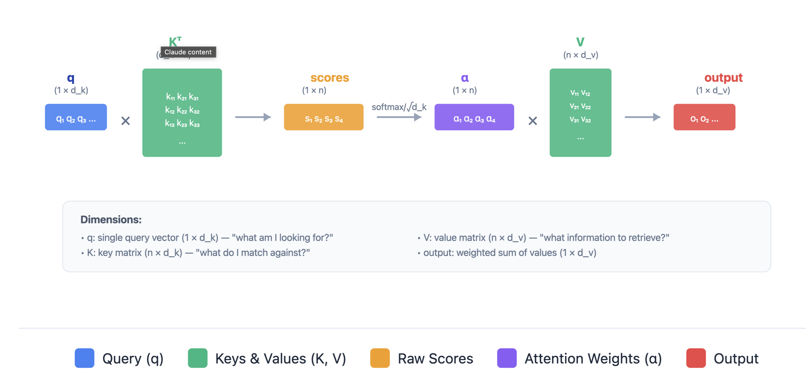
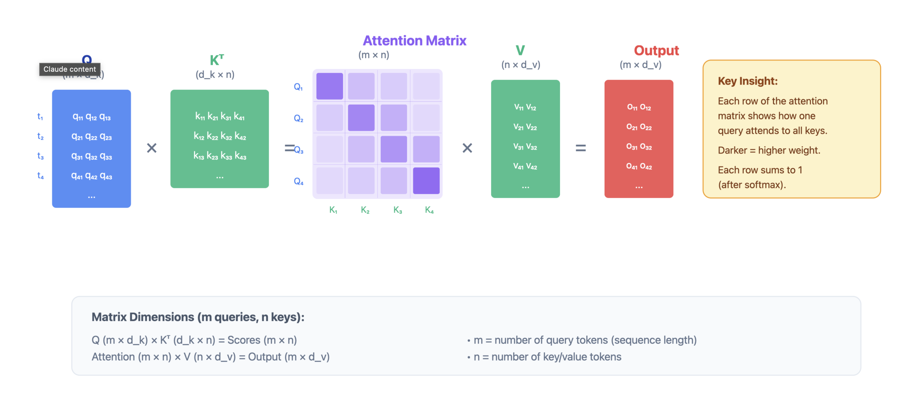
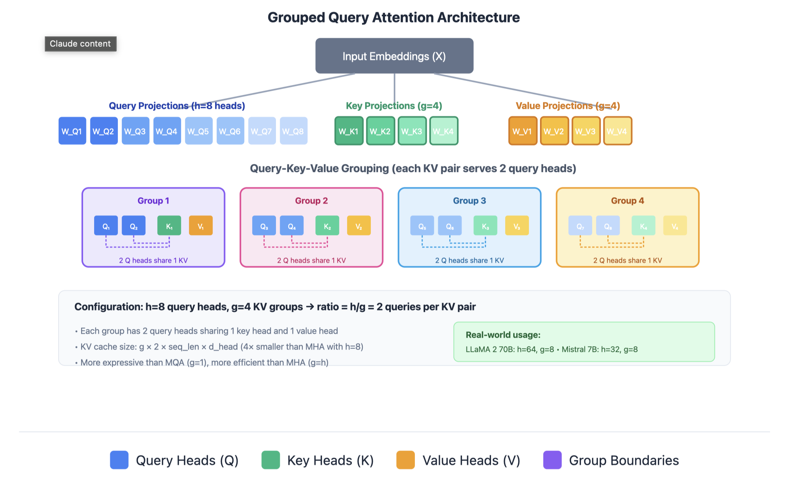
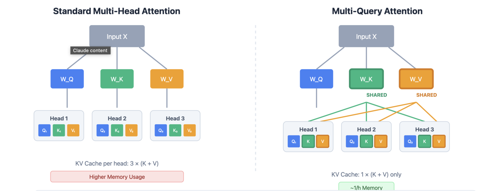

# Attention Mechanism

## Single Query Attention

A single query vector attends to all key-value pairs. The query is compared with each key to produce attention weights, which determine how much information to retrieve from each value.

Attention(q, K, V) = softmax( (q K^T) / √d_k ) V

Where:
- q: Query vector (d_k-dimensional)
- K: Key matrix (num_keys × d_k)
- V: Value matrix (num_keys × d_v)
The query vector is compared against all keys to compute attention weights, which are then used to take 
a weighted sum of the values.

## Batched Query Attention (Standard Transformer)
Multiple queries attend to the same keys and values simultaneously. This is the standard attention computation in transformers, enabling parallel processing of all tokens in a sequence.
Attention(Q, K, V) = softmax( (Q K^T) / √d_k ) V

Where:
- Q: Query matrix (batch_size × seq_len × d_k)
- K: Key matrix (batch_size × seq_len × d_k)
- V: Value matrix (batch_size × seq_len × d_v)

## Multi-head Attention
Multi-head attention allows the model to attend to information from different representation subspaces. Instead of computing attention once, we compute it h times in parallel with different learned projections:
head_i = Attention(Q W^Q_i, K W^K_i, V W^
V_i)
Then we concatenate the outputs of all heads and project back to the original dimension:
Multi-Head Attention(Q, K, V) = Concat(head_1, ..., head
h) W^O
Where:
- Q: Query matrix (batch_size × seq_len × d_model)
- K: Key matrix (batch_size × seq_len × d_model)
- V: Value matrix (batch_size × seq_len × d_model)
- W^Q_i, W^K_i, W^V_i: Learned projection matrices
- W^O: Output projection matrix

## Multi Query Attention
Multi-query attention is a variant where multiple queries attend to the same key and value, but each query has its own set of keys and values. This can be useful for certain architectures or efficiency optimizations.

## Group Query Attention
In practice, we compute attention for a batch of queries (Q) attending to the same key and value:

Attention(Q, K, V) = softmax( (Q K^T) / √d_k ) V

Where:
- Q: Query matrix (num_queries × d_k)
- K: Key matrix (num_keys × d_k)
- V: Value matrix (num_keys × d_v)

In GQA, query heads are divided into groups, and each group shares a single set of key-value heads. This provides a balance between the expressiveness of MHA and the efficiency of MQA. 

