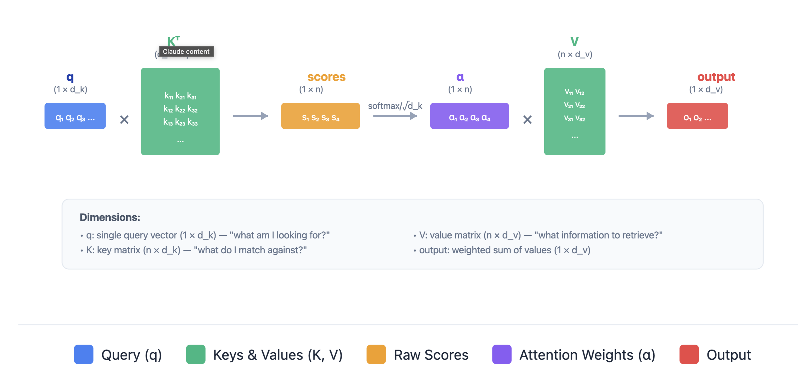
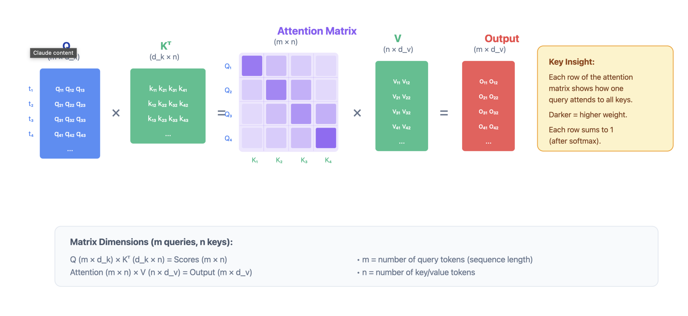
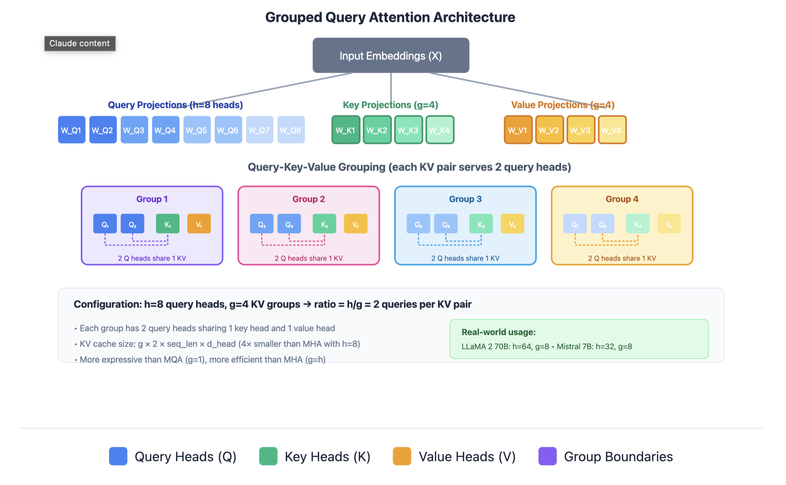
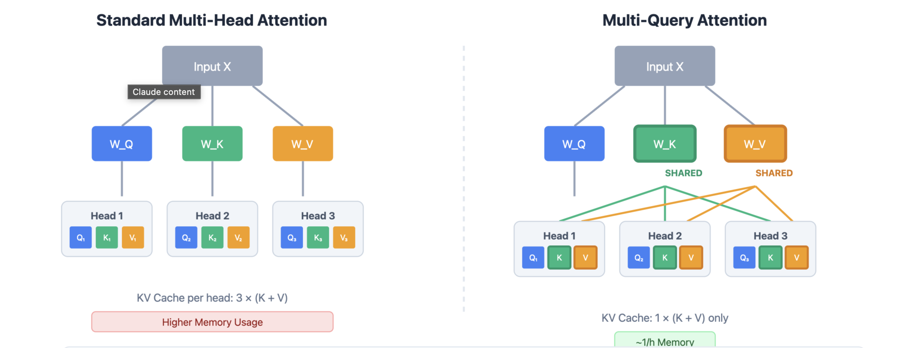

# Attention Mechanism

## Understanding Dimensions

**Key dimension terms:**
- **`d_model`**: The full embedding/hidden dimension of the model (e.g., 768, 1024, 4096)
- **`d_k`**: The dimension per attention head = `d_model / num_heads`
- **`d_v`**: The value dimension per head (typically equals `d_k`)

**Example:** If `d_model = 768` and `num_heads = 12`, then `d_k = 64` per head.

## Computing Q, K, V from Input Embeddings

Queries, keys, and values are linear transformations of the input embeddings:

```
Q = X W^Q
K = X W^K
V = X W^V
```

Where:
- **X**: Input embeddings (batch_size × seq_len × d_model)
- **W^Q, W^K, W^V**: Learned projection matrices (d_model × d_model)
- **Q, K, V**: Resulting query, key, value matrices

In multi-head attention, each head has smaller projection matrices:
- **W^Q_i**: (d_model × d_k) for head i
- **W^K_i**: (d_model × d_k) for head i
- **W^V_i**: (d_model × d_v) for head i

## Single Query Attention

A single query vector attends to all key-value pairs. The query is compared with each key to produce attention weights, which determine how much information to retrieve from each value.

Attention(q, K, V) = softmax( (q K^T) / √d_k ) V

Where:
- q: Query vector (d_k-dimensional)
- K: Key matrix (num_keys × d_k)
- V: Value matrix (num_keys × d_v)
The query vector is compared against all keys to compute attention weights, which are then used to take 
a weighted sum of the values.



## Batched Query Attention (Standard Transformer)
Multiple queries attend to the same keys and values simultaneously. This is the standard attention computation in transformers, enabling parallel processing of all tokens in a sequence.
Attention(Q, K, V) = softmax( (Q K^T) / √d_k ) V

Where:
- Q: Query matrix (batch_size × seq_len × d_k)
- K: Key matrix (batch_size × seq_len × d_k)
- V: Value matrix (batch_size × seq_len × d_v)



## Multi-head Attention
Multi-head attention allows the model to attend to information from different representation subspaces. Instead of computing attention once, we compute it h times in parallel with different learned projections:

```
head_i = Attention(X W^Q_i, X W^K_i, X W^V_i)
Multi-Head Attention(X) = Concat(head_1, ..., head_h) W^O
```

Where:
- **X**: Input embeddings (batch_size × seq_len × d_model)
- **W^Q_i, W^K_i, W^V_i**: Learned projection matrices for head i (d_model × d_k)
- **W^O**: Output projection matrix (h × d_k → d_model)
- **h**: Number of attention heads
- **d_k**: Dimension per head = d_model / h

**Example dimensions:**
- Input: (32 × 512 × 768) — batch_size=32, seq_len=512, d_model=768
- With 12 heads: d_k = 768/12 = 64
- Each head output: (32 × 512 × 64)
- Concatenated: (32 × 512 × 768)
- After W^O: (32 × 512 × 768)



## Multi Query Attention
Multi-query attention is a variant where multiple queries attend to the same key and value, but each query has its own set of keys and values. This can be useful for certain architectures or efficiency optimizations.



### Visual Comparison
#### Multi-head Attention (MHA)
```
Head 1:  Q1 → K1, V1
Head 2:  Q2 → K2, V2
...
Head 32: Q32 → K32, V32
```
#### Multi-query Attention (MQA)
```
Head 1:  Q1 → K_shared, V_shared
Head 2:  Q2 → K_shared, V_shared
...
Head 32: Q32 → K_shared, V_shared
```

## Group Query Attention
In practice, we compute attention for a batch of queries (Q) attending to the same key and value:

Attention(Q, K, V) = softmax( (Q K^T) / √d_k ) V

Where:
- Q: Query matrix (num_queries × d_k)
- K: Key matrix (num_keys × d_k)
- V: Value matrix (num_keys × d_v)

In GQA, query heads are divided into groups, and each group shares a single set of key-value heads. This provides a balance between the expressiveness of MHA and the efficiency of MQA. 


### Visual Comparison
#### Grouped-Query Attention (GQA) (e.g., G=8)
```
Query Heads:   Q1 Q2 Q3 Q4  Q5 Q6 Q7 Q8  ...  Q32
                 ↓   ↓   ↓     ↓   ↓   ↓        ↓
Group 1:     Shared K1   Shared V1
Group 2:     Shared K2   Shared V2
...
Group 8:     Shared K8   Shared V8
```

- 32 Query heads are divided into 8 groups (4 queries per group).
- Each group shares its own Key and Value head.