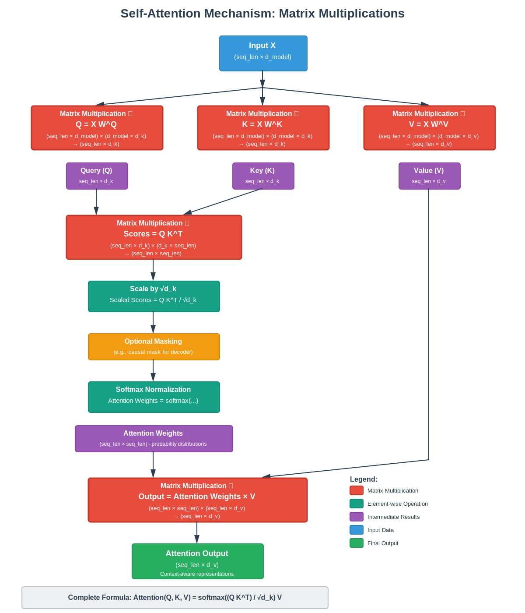
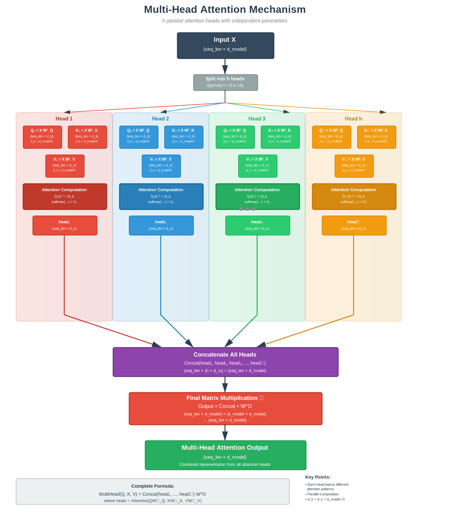

# Self Attention

## The Core Mechanism: Self-Attention (Scaled Dot-Product Attention)
Self-attention is the heart of the Transformer. It allows every token in a sequence to attend to every other token (including itself), capturing contextual relationships in parallel.

For an input sequence of tokens represented as matrix X (shape: sequence_length × d_model), self-attention works as follows:

1. Project the input into three matrices using learned linear transformations: \
Query matrix:   Q = X W^Q \
Key   matrix:   K = X W^K \
Value matrix:  V = X W^V \
(W^Q, W^K ∈ ℝ^{d_model × d_k},   W^V ∈ ℝ^{d_model × d_v}; usually d_k = d_v = d_model / h)

2. Compute raw attention scores via dot product: \
Scores = Q K^T    (shape: seq_len × seq_len)

3. Scale by √d_k to stabilize gradients (prevents vanishing/exploding when d_k is large): \
Scaled Scores = Q K^T / √d_k

4. Apply optional masking (e.g., in decoder to prevent future peeking).

5. Normalize with softmax to get attention weights (probabilities): \
Attention Weights = softmax(Scaled Scores)

6. Weighted sum of values: \
Attention(Q, K, V) = Attention Weights × V

This produces a new representation for each token that is a context-weighted combination of all tokens' values.
Here is the mathematical formulation: \
Attention(Q, K, V) = softmax( (Q K^T) / √d_k ) V

# Multi-head Attention

Instead of performing attention once with d_model-dimensional vectors, the Transformer splits the attention into h parallel "heads" (typically h=8 or 16). Each head operates in a lower-dimensional subspace (d_k = d_v = d_model / h).

- Each head has its own independent W^Q_i, W^K_i, W^V_i matrices.
- Compute attention independently in each head.
- Concatenate the h outputs → project back to d_model with a final linear layer.

Multi-Head Attention(Q, K, V) = Concat(head_1, ..., head_h) W^O \
Where head_i = Attention(Q W^Q_i, K W^K_i, V W^V_i)

## Benefits:

Allows the model to jointly attend to information from different representation subspaces (syntax, semantics, coreference, etc.).
Improves expressivity and generalization.

