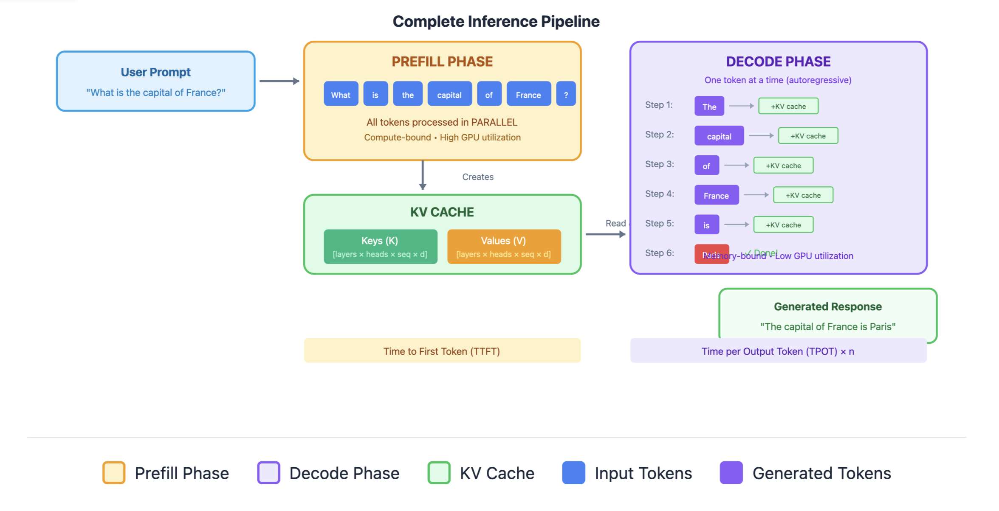
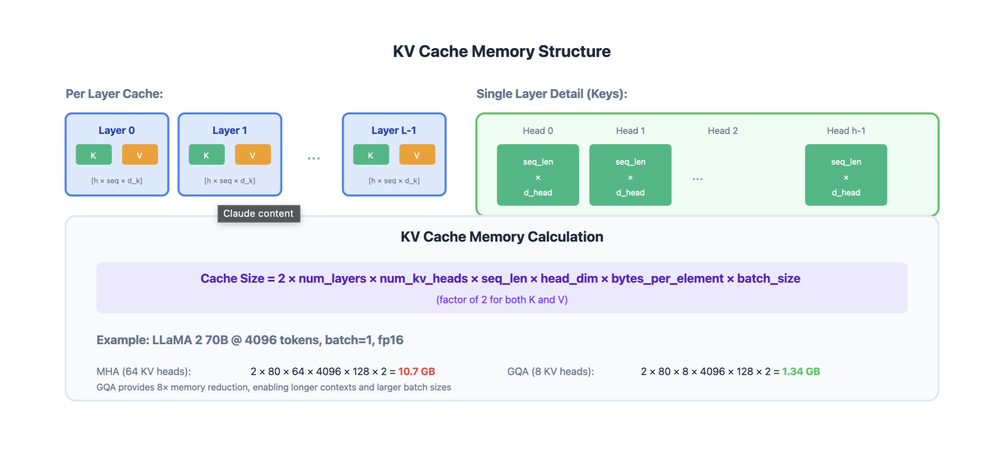

# LLM Inference

## Two Phases of LLM Inference
When you send a prompt to an LLM and it generates a response, inference happens in two distinct phases:



### Phase 1: Prefill (Prompt Processing)
The prefill phase processes the input prompt in parallel.

Characteristics:

- Parallel computation: All prompt tokens processed simultaneously
- Compute-bound: Heavy matrix multiplications (GPU cores fully utilized)
- One forward pass: Single pass through all transformer layers
- Generates KV cache: Stores key-value pairs for all prompt tokens

### Phase 2: Decode
The model generates tokens one at a time, autoregressively.

Characteristics:

- Sequential computation: One token per forward pass
- Memory-bound: Small compute per step, bottlenecked by memory bandwidth
- Many forward passes: One pass per generated token
- Extends KV cache: Adds new key-value pairs each step

### Without KV Cache (Naive Approach)
Generating token 100:
- Recompute K, V for tokens 1-99 (wasteful!)
- Compute Q for token 100
- Attention over all 100 positions
- Complexity: O(n²) per token → O(n³) total for n tokens

With KV Cache (Standard Approach)
Generating token 100:
- Retrieve cached K, V for tokens 1-99
- Compute K, V only for token 100, append to cache
- Compute Q for token 100
- Attention over all 100 positions
- Complexity: O(n) per token → O(n²) total for n tokens

## Memory Analysis


### KV Cache Size Formula
```
KV Cache Memory = 2 × num_layers × num_heads × seq_len × head_dim × bytes_per_element × batch_size

Note:
- 2 for Key and Value
- num_layer as each layer has its own K and V matrices
- each layer has multiple attention heads
- seq_len is number of tokens in context
- bytes_per_element is precision (FP32, FP16 etc.)
- batch_size is number of sequences processed simultaneously
```

**Example: LLaMA 2 70B**
```
- Layers: 80
- Heads: 64 (with GQA: 8 KV heads)
- Head dim: 128
- Sequence: 4096 tokens
- Dtype: float16 (2 bytes)
- Batch: 1

KV Cache = 2 × 80 × 8 × 4096 × 128 × 2 × 1
         = 1.34 GB per sequence!
```

This is why KV cache memory is often the bottleneck for serving LLMs.

## Prefill vs Decode: Computational Profile

| Aspect | Prefill | Decode |
|--------|---------|--------|
| **Tokens processed** | All prompt tokens (parallel) | One token (sequential) |
| **Compute intensity** | High (compute-bound) | Low (memory-bound) |
| **GPU utilization** | High (matrix ops) | Low (memory transfers) |
| **Bottleneck** | FLOPS | Memory bandwidth |
| **Latency** | Time to First Token (TTFT) | Time per Output Token (TPOT) |
| **KV cache** | Created | Extended |

## The Memory Bandwidth Problem in Decode

During decode, for each token:
1. Load model weights: ~140 GB (for 70B model in FP16)
2. Load KV cache: ~1-10 GB (depends on sequence length)
3. Compute: Very small amount of actual math
4. Store updated KV cache