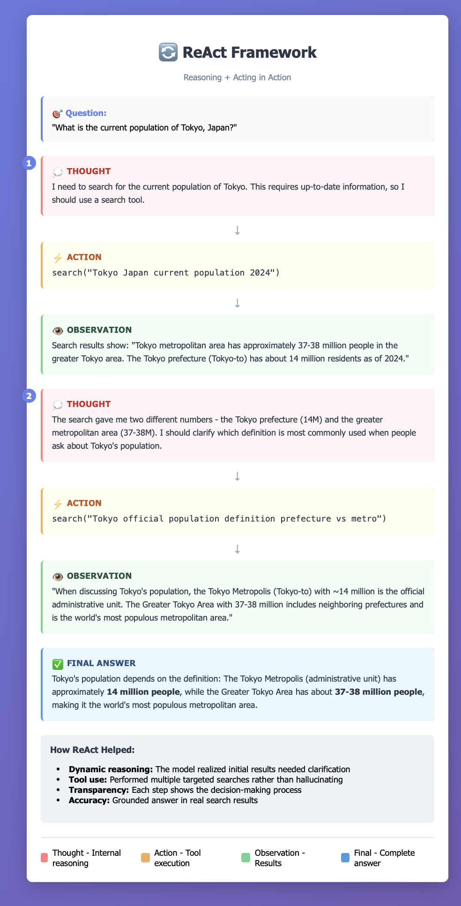

# LLM Reasoning

## Introduction to LLM Reasoning
LLM reasoning refers to the ability of large language models to perform complex cognitive tasks that require understanding, logical thinking, and multi-step problem-solving. Unlike simple pattern matching or text completion, reasoning involves the capacity to:

- **Break down complex problems** into manageable steps
- **Apply logical rules** and inference to reach conclusions
- **Maintain consistency** across multiple reasoning steps
- **Draw connections** between seemingly unrelated concepts
- **Evaluate and verify** the correctness of intermediate steps

Modern LLMs exhibit emergent reasoning capabilities that improve with scale, training methods, and prompting techniques. These capabilities enable applications in mathematical problem-solving, code generation, scientific analysis, and decision-making tasks that require more than surface-level language understanding. 

## Types of Reasoning
Following are the popular types of LLM reasoning frameworks:

### Chain of Thought (CoT)
#### How Chain of Thought Works
Chain of Thought (CoT) is a prompting technique that improves LLM reasoning by encouraging the model to break down complex problems into intermediate steps before arriving at a final answer.

#### Two Main Approaches
1. Few-Shot CoT - Provide examples with reasoning steps in the prompt:

Include 2-3 example problems showing step-by-step reasoning. The model learns the pattern and applies it to new problems

2. Zero-Shot CoT - Simply add "Let's think step by step" to your prompt:

- Remarkably effective with just this simple phrase
- No examples needed
- Works across many problem types

[CoT Examples](cot-examples.md)

#### Key Benefits
- Improved accuracy - Especially on math, logic, and multi-step reasoning tasks. Performance gains of 20-50% on complex problems.
- Error detection - Intermediate steps make it easier to spot where reasoning went wrong
- Interpretability - You can see exactly how the model arrived at its answer
- Handles complexity - Breaks down problems that would overwhelm direct answering

### Reason and Act (ReAct)
#### How ReAct Works
In traditional approaches, LLMs either reason internally (chain-of-thought) or take actions (like using tools) separately. ReAct combines both by having the model alternate between:

1. Thought - The model reasons about what to do next
2. Action - The model takes an action (like calling a tool, searching, or executing code)
3. Observation - The model receives feedback from that action
4. Repeat - This cycle continues until the task is complete

[ReAct: Synergizing Reasoning and Acting in Language Models](https://react-lm.github.io)

CoT is best for problems solvable through pure reasoning (math, logic puzzles), while ReAct shines when you need to interact with external systems (searching, calculating, accessing databases).

### Tree of Thought

### Graph of Thought

### LLM Compiler

### Plan and Execute

### Language Agent Tree Search

### Think Critique Improve

## Test Time Compute - Beam Search

### Best of N

### Beam Search

### Lookahead Search

