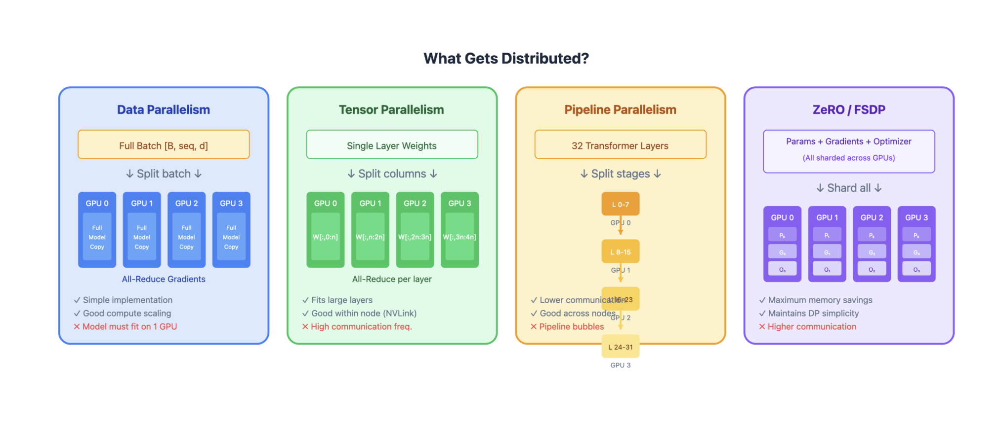
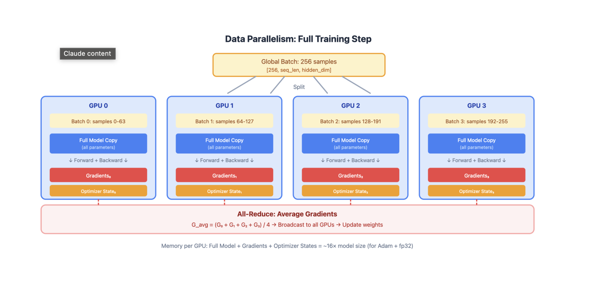
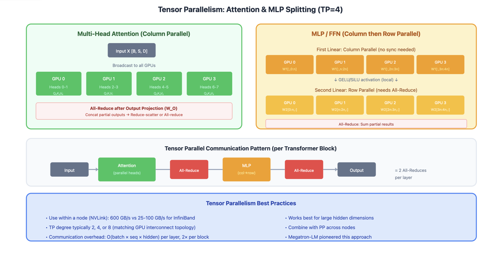
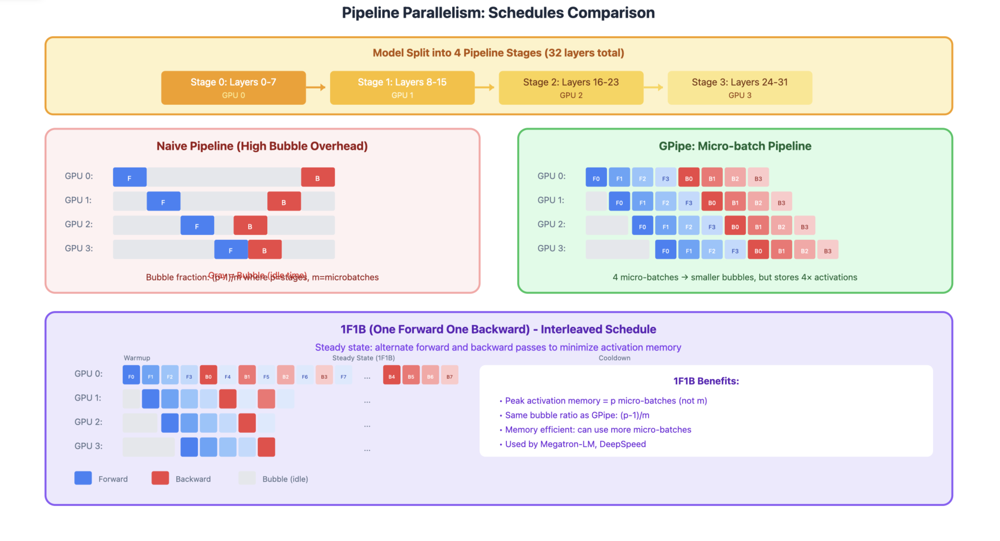

# Model Parallelization Techniques
As models grow to hundreds of billions of parameters, they can't fit on a single GPU. Parallelization techniques distribute the model, data, or computation across multiple devices.

## Overview of Parallelization Strategies

| Technique                    | What's Distributed                     | Communication                     | Memory Efficiency | Compute Efficiency        |
|------------------------------|----------------------------------------|-----------------------------------|-------------------|---------------------------|
| Data Parallelism (DP)       | Data batches                          | Gradient sync                     | Low               | High                      |
| Tensor Parallelism (TP)     | Individual layers                     | Activation sync                   | High              | Medium                    |
| Pipeline Parallelism (PP)   | Layer groups                          | Activation passing                | High              | Medium (bubbles)          |
| Sequence Parallelism (SP)   | Sequence dimension                    | Activation sync                   | High              | High                      |
| Expert Parallelism (EP)     | MoE experts                           | Token routing                     | High              | High                      |
| ZeRO / FSDP                 | Optimizer states, gradients, params  | All-gather / reduce-scatter      | Very High         | High                      |



## 1. Data Parallelism (DP)
```
GPU 0: Full Model Copy → Process Batch 0 → Gradients₀
GPU 1: Full Model Copy → Process Batch 1 → Gradients₁
GPU 2: Full Model Copy → Process Batch 2 → Gradients₂
GPU 3: Full Model Copy → Process Batch 3 → Gradients₃
                              ↓
                    All-Reduce Gradients
                              ↓
                    Update All Model Copies
```



### How it works:
1. Each GPU holds a complete copy of the model
2. Global batch is split across GPUs
3. Each GPU computes forward/backward on its local batch
4. Gradients are synchronized via all-reduce
5. Each GPU updates its local model copy

### Pros:
- Simple to implement
- Near-linear scaling for compute
- No model code changes needed

### Cons:
- Model must fit on single GPU
- Memory inefficient (redundant model copies)
- Communication scales with model size

## 2. Tensor Parallelism (TP)
Split individual layers across GPUs. Each GPU holds a slice of every layer.
For Linear Layers (Column Parallel)
```
Weight Matrix W [d_in × d_out]:

         GPU 0          GPU 1
      ┌─────────┐    ┌─────────┐
      │ W[:,:n] │    │ W[:,n:] │
      └─────────┘    └─────────┘
      
Input X → [X @ W₀]    [X @ W₁] → Concat → Output
```
For Attention
```
Q, K, V projections split by heads:

GPU 0: Heads 0-3  →  Attention₀  →  Output₀
GPU 1: Heads 4-7  →  Attention₁  →  Output₁
                          ↓
                    All-Reduce (for output projection)
```



### Communication pattern:

- All-reduce after attention output projection
- All-reduce after MLP second linear layer

### Pros:

- Enables models larger than single GPU memory
- Preserves batch size (good for latency)
- Works well within a node (fast NVLink)

### Cons:

- High communication overhead between nodes
- Requires careful implementation
- Synchronization at every layer

## 3. Pipeline Parallelism (PP)
Split model into sequential stages, each on different GPU(s).

```
Stage 0 (GPU 0)     Stage 1 (GPU 1)     Stage 2 (GPU 2)     Stage 3 (GPU 3)
┌─────────────┐     ┌─────────────┐     ┌─────────────┐     ┌─────────────┐
│ Layers 0-7  │ ──► │ Layers 8-15 │ ──► │ Layers 16-23│ ──► │ Layers 24-31│
└─────────────┘     └─────────────┘     └─────────────┘     └─────────────┘
```


The Bubble Problem
Naive pipeline has idle time (bubbles):
```
Time →
GPU 0: [F0][F1][F2][F3][  ][  ][  ][  ][B3][B2][B1][B0]
GPU 1: [  ][F0][F1][F2][F3][  ][  ][B3][B2][B1][B0][  ]
GPU 2: [  ][  ][F0][F1][F2][F3][B3][B2][B1][B0][  ][  ]
GPU 3: [  ][  ][  ][F0][F1][F2][F3][B3][B2][B1][B0][  ][  ][  ]
        ↑ Bubbles (idle time)
```

GPipe: Micro-batching
Split batch into micro-batches to reduce bubbles:
```
Time →
GPU 0: [F0][F1][F2][F3][B0][B1][B2][B3]
GPU 1: [  ][F0][F1][F2][F3][B0][B1][B2][B3]
GPU 2: [  ][  ][F0][F1][F2][F3][B0][B1][B2][B3]
GPU 3: [  ][  ][  ][F0][F1][F2][F3][B0][B1][B2][B3]
        ↑ Much smaller bubbles!
```

1F1B Schedule (Interleaved)
Interleave forward and backward passes:
```
GPU 0: [F0][F1][F2][F3][B0][F4][B1][F5][B2][B3][B4][B5]
GPU 1: [  ][F0][F1][F2][B0][F3][B1][F4][B2][F5][B3][B4][B5]
...
```

### Pros:

- Memory efficient (only store activations at boundaries)
- Works well across nodes (less communication)
- Can combine with TP within stages

### Cons:

- Pipeline bubbles reduce efficiency
- Complex scheduling
- Load balancing between stages

## 4. Sequence Parallelism (SP)
Split the sequence dimension across GPUs. Useful for very long sequences.
```
Sequence: [Token 0, Token 1, ..., Token 8191]

GPU 0: Tokens 0-2047      →  Local Attention  →  Output₀
GPU 1: Tokens 2048-4095   →  Local Attention  →  Output₁  
GPU 2: Tokens 4096-6143   →  Local Attention  →  Output₂
GPU 3: Tokens 6144-8191   →  Local Attention  →  Output₃

For cross-partition attention: Ring attention / All-to-all communication
```

Ring Attention:

- KV pairs are passed in a ring between GPUs
- Each GPU computes partial attention, accumulates results
- Enables arbitrarily long sequences

### Pros:

- Enables very long context lengths
- Reduces memory per GPU for activations
- Complements tensor parallelism

### Cons:

- Complex implementation
- Communication overhead for attention
- Need careful handling of causal masks

## 5. Expert Parallelism (EP)
For Mixture of Experts (MoE) models, distribute experts across GPUs.
```
Input Tokens
     ↓
  Router (on all GPUs)
     ↓ (token routing decisions)
┌────┴────┬────┴────┬────┴────┬────┴────┐
│ GPU 0   │ GPU 1   │ GPU 2   │ GPU 3   │
│Expert 0 │Expert 1 │Expert 2 │Expert 3 │
│Expert 4 │Expert 5 │Expert 6 │Expert 7 │
└────┬────┴────┬────┴────┬────┴────┬────┘
     └─────────┴─────────┴─────────┘
                  ↓
            All-to-All (gather results)
                  ↓
              Combined Output
```

Communication:

- All-to-all to send tokens to their assigned experts
- All-to-all to gather results back

### Pros:

- Natural parallelism for MoE
- Experts are independent (no sync needed)
- Scales number of parameters without scaling compute

### Cons:

- Load imbalance if routing is uneven
- All-to-all communication can be expensive
- Requires balanced expert assignment

## 6. ZeRO (Zero Redundancy Optimizer) / FSDP
Progressive sharding of optimizer states, gradients, and parameters.
### ZeRO Stages
#### ZeRO-1: Shard Optimizer States

```
GPU 0: Full Params, Full Grads, Optimizer₀ (1/N params)
GPU 1: Full Params, Full Grads, Optimizer₁ (1/N params)
GPU 2: Full Params, Full Grads, Optimizer₂ (1/N params)
GPU 3: Full Params, Full Grads, Optimizer₃ (1/N params)

Memory per GPU: Params + Grads + Optimizer/N
```
####  ZeRO-2: Shard Optimizer States + Gradients
```
GPU 0: Full Params, Grads₀, Optimizer₀
GPU 1: Full Params, Grads₁, Optimizer₁
GPU 2: Full Params, Grads₂, Optimizer₂
GPU 3: Full Params, Grads₃, Optimizer₃

Memory per GPU: Params + (Grads + Optimizer)/N
```

#### ZeRO-3: Shard Everything
```
GPU 0: Params₀, Grads₀, Optimizer₀
GPU 1: Params₁, Grads₁, Optimizer₁
GPU 2: Params₂, Grads₂, Optimizer₂
GPU 3: Params₃, Grads₃, Optimizer₃

Memory per GPU: (Params + Grads + Optimizer)/N
```

Communication:

All-gather parameters before forward/backward
Reduce-scatter gradients after backward

### Pros:

- Dramatic memory savings
- Maintains data parallelism simplicity
- Scales to very large models

### Cons:

- Increased communication volume
- ZeRO-3 has highest communication cost
- May need communication-computation overlap

## 7. 3D Parallelism
Combine DP, TP, and PP for maximum scale.
```
Example: 64 GPUs = 4 (DP) × 4 (TP) × 4 (PP)

         ┌─── DP Replica 0 ───┐    ┌─── DP Replica 1 ───┐
         │                    │    │                    │
PP Stage │  TP Group 0-3     │    │  TP Group 16-19   │
    0    │  (Layers 0-7)     │    │  (Layers 0-7)     │
         │                    │    │                    │
         ├────────────────────┤    ├────────────────────┤
PP Stage │  TP Group 4-7     │    │  TP Group 20-23   │
    1    │  (Layers 8-15)    │    │  (Layers 8-15)    │
         │                    │    │                    │
         ├────────────────────┤    ├────────────────────┤
PP Stage │  TP Group 8-11    │    │  TP Group 24-27   │
    2    │  (Layers 16-23)   │    │  (Layers 16-23)   │
         │                    │    │                    │
         ├────────────────────┤    ├────────────────────┤
PP Stage │  TP Group 12-15   │    │  TP Group 28-31   │
    3    │  (Layers 24-31)   │    │  (Layers 24-31)   │
         └────────────────────┘    └────────────────────┘
```

### Guidelines:

- TP within nodes: Fast NVLink communication
- PP across nodes: Lower bandwidth needed
- DP across replicas: Gradient sync less frequent